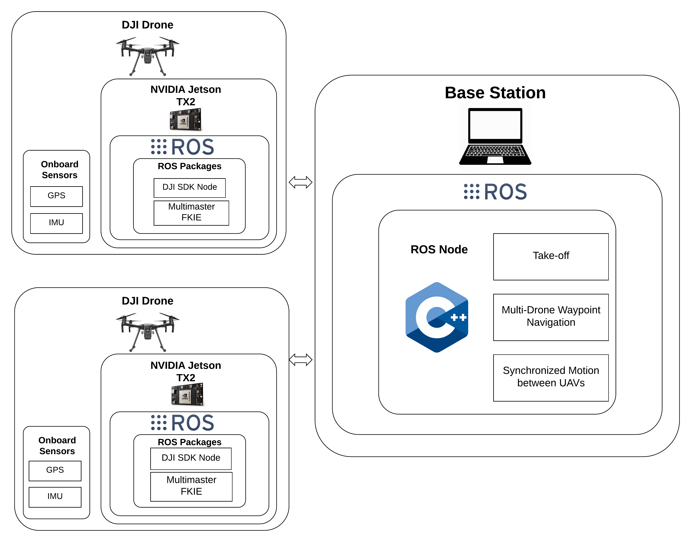
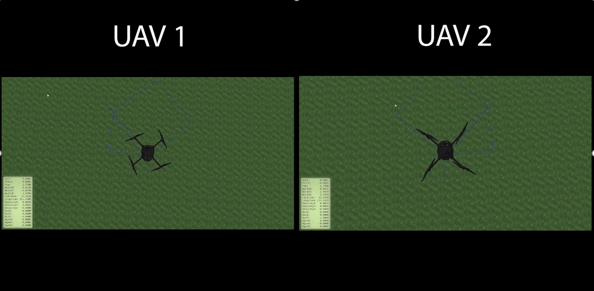

# Inertial Navigation for Multi-Drone formation using DJI M100/M600

This project was done as part of a research work inside the GENESYS (-Next GEneration NEtworks and SYStems) Lab at Northeastern University.

This repo contains a ROS package that connects to multiple DJI drones via a shared network to move them around in a desired formation. 
The desired formation waypoints are hardcoded in terms of distance but are independent of location.
The ROS nodes can be used to launch DJI drones anywhere using the DJI ROS SDK to communicate with the onboard sensors.

## Setup:
1. You need a Main Computer (MC) that controls the drones and will have this repo and its nodes running on it. 
   1. The MC will need to have [DJI SDK](https://github.com/dji-sdk/Onboard-SDK) and [Onboard ROS SDK](https://github.com/dji-sdk/Onboard-SDK-ROS/tree/master/src/dji_osdk_ros) installed in it.
   2. For converting GPS coordinates to UTM coordinates and to set up a shared coordinate frame, we will use the [Geonav_Transform](https://github.com/bsb808/geonav_transform) package.
   3. To be able to take control of all nodes in the same network, we will have each system running the [Multi-Master](https://github.com/fkie/multimaster_fkie) discovery and sync nodes.
2. Each drone that is part of the system and that you want to control will need to have a Companion Computer(CC) on it. 
    In my case each drone had Nvidia TX2 loaded below the base of the DJI drone via a companion board.
    1. Each CC will need to have DJI SDK and Onboard ROS SDK installed on it.
    2. You will have to activate each CC using the DJI Go app to be able to control it during flight and to run the DJI SDK nodes on it.
    3. For Multi-Master control each CC should have the multi-master ROS packages in their workspace.
    4. Each CC on boot-up should automatically connect with a shared network. This can be configured using crono if you're familiar with it.
    5. An important point to note is that all the nodes from a particular DJI-TX2 should be namespaced with a unique label to be able to easily identify and specifically control that particular UAV.
       In my case each DJI-TX2 was namespaced at "frl-tx2X" where "X" is the drone number. Few label examples would be as such: frl-tx21, frl-tx26, frl-tx29 and so on.
    6. On boot-up all DJI-TX2s should have the multi-master discovery and sync nodes running to broadcast all nodes of that system onto the shared network. 
       Along with that all of the DJI-TX2s should have the [DJI SDK node](https://github.com/dji-sdk/Onboard-SDK-ROS/blob/master/launch/dji_sdk_node.launch) running on boot-up as well to broadcast all GPS,IMU and velocity control nodes and topics onto the shared network as well.
       
Here is a Hardware Connection Diagram for simulation:

Here is a Hardware Connection Diagram for Physical DJI Drones:

## Installation:

1. Create a ROS workspace. I use [catkin tools](https://catkin-tools.readthedocs.io/en/latest/installing.html) to build my workspace.
2. Clone the [multi-master fkie](https://github.com/fkie/multimaster_fkie) package and run `catkin build`.
3. Clone the [Geonav_Transform](https://github.com/bsb808/geonav_transform) package and run `catkin build`.
4. Install the [Onboard DJI SDK](https://github.com/dji-sdk/Onboard-SDK) on your system (preferably outside the ROS workspace).
5. Clone the [Onboard DJI ROS SDK](https://github.com/dji-sdk/Onboard-SDK-ROS/tree/master/src/dji_osdk_ros) in your workspace and run `catkin build`.
4. Clone this repo and check out the feature/DJI/beam_forming branch: `git checkout feature/DJI/beam_forming`.
5. Now run `catkin build` and you should have all the required ROS packages and nodes set up for controlling the DJI drones.

## How to Use:

Assuming you have followed all the instructions that are part of the setup on both the MC and the CCs, I will now continue to control two drones to hover at their starting position and make them trace a square trajectory and come back at their original position.

1. First launch the ROS Master on your MC:
  `roscore`
 
2. Now launch the multimaster discovery node to detect all the ROS Masters on your shared network.
    Note: Make sure you are on the same wifi network as the TX2s running the DJI SDK nodes and multi-master nodes.
   `rosrun master_discovery_fkie master_discovery`
   
3. Next launch the multimaster sync node to load all the topics and nodes from the ROS Masters detected in the network and sync with them in real-time.
    `rosrun master_sync_fkie master_sync`
    
4. With all this set up, we can now first launch geonav transform package to convert GPS coordinates to local coordinates.
    You can launch the [geonav_two_node.launch](https://github.com/rishabhgks/two_drones/blob/feature/DJI/beam_forming/launch/geonav_two_node.launch) file.
    Before launching you want to change the namespace of the two nodes inside the launch file to the namespace you have configured for your TX2s. Once done with that, if you want the local coordinates to be really small in numbers then you can change the datum (GPS location) of the geonav package to be really close to your launch position. This will help you out in dealing with small coordinates for your program.
    Run the following launch file:
    `roslaunch two_drones geonav_two_node.launch`
    
5. At this point, if you have run `rostopic list` or `rosnode list` then you will see all the DJI topics and nodes running on the TX2s along with the utm and odom topics from the geonav package converting the gps data in real-time.

6. Now lets head to our main code:
    First open up the hover_node.cpp file in the src folder and change the hardcoded namespace of the two drones to the namepsace you configured for your tx2s. There should be a total of 2 locations where the names must be present at the begining of the file.
    Once you are done with that, run `catkin build` to compile the changes,
    Now run the roslaunch file:
    `roslaunch two_drones hover.launch`

This should more or less do the job for running this repository on your local system.
If you don't have access to a flight authorized area, you can also use the free DJI SImulator windows software that lets you connect your DJI drones to the simulator and see how the code affects the drones.

Here is a snippet of my execution from controlling two drones in DJI simulator for a different formation:

